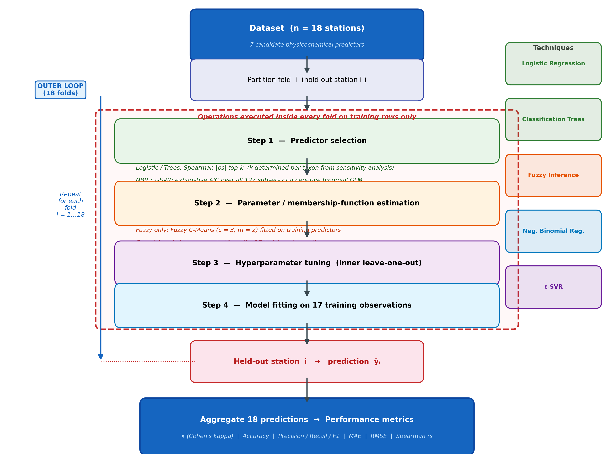

# Cali River Biomonitoring: Ecological Water Quality Modelling

[](https://github.com/saulo1112/cali-river-biomonitoring/actions/workflows/pages.yml)

**Live demo (bilingual ES/EN): <https://saulo1112.github.io/cali-river-biomonitoring/>**

Machine learning models that predict the hydrobiological water quality of the
**Cali River** (Valle del Cauca, Colombia) from routine physicochemical
measurements, using aquatic macroinvertebrates as bioindicators. The repository
contains the complete analysis behind the article *"A comparative machine
learning framework for water quality and habitat suitability modelling under
severe data scarcity in the Cali River, Colombia"* (Quiñones-Góngora &
Holguín-González, Universidad Autónoma de Occidente): five modelling
techniques, one validation protocol, three prediction targets, evaluated on
18 records from 9 monitoring stations.

**Status.** The analysis is finished: all notebooks have been run to
completion, the three winning models are exported, and they are served by the
prediction interface linked above. The numbers in this document are the nested
leave-one-out results reported in the manuscript.

## Table of contents

- [Study context](#study-context)
- [Data](#data)
- [Targets and techniques](#targets-and-techniques)
- [Validation protocol: nested LOOCV](#validation-protocol-nested-loocv)
- [Results](#results)
- [Scope and limitations](#scope-and-limitations)
- [Notebooks](#notebooks)
- [Prediction interface](#prediction-interface)
- [Repository structure](#repository-structure)
- [Reproducing the analysis](#reproducing-the-analysis)
- [Citation](#citation)

---

## Study context

The Cali River is an urban tropical river that descends from the Farallones de
Cali into the city, under increasing human pressure that shows in both its
physicochemical condition and a simplified benthic macroinvertebrate community.
The project asks a practical question on behalf of a resource-constrained
monitoring programme:

> Given only routine physicochemical measurements and a handful of monitoring
> stations, can water quality and the presence of pollution-sensitive taxa be
> predicted well enough to be useful?

The answer, established by measurement rather than assumed, differs by target;
see [Results](#results).

## Data

- **Source:** Corporación Autónoma Regional del Valle del Cauca (CVC), collected
  under the Cali River Water Resource Management Plan (2021–2022).
- **Size: n = 18 records from 9 stations**, each sampled once in the dry season
  and once in the rainy season. This constraint shapes every methodological
  decision; see [the validation protocol](#validation-protocol-nested-loocv).
- **Two input files** in `data/` (not version-controlled; request them from the
  authors or CVC):
  - `DB - Macroinvertebrados.xlsx`: physicochemical predictors plus binary
    presence/absence of `Perlidae` and `Trichoptera` (Helicopsychidae).
  - `Database - BMWP.xlsx`: physicochemical predictors plus the continuous
    `BMWP` index per station.
- **Candidate predictors.** Only directly measured quantities are used (no
  composite or component-score variables). PCA was used solely as an
  exploratory redundancy screen to narrow 37 measured variables to the nine
  below. Column names are kept in Spanish in the code.

  | Column | Variable | Unit | General pool (7) | Fuzzy pool (5) |
  |--------|----------|------|:---:|:---:|
  | `COT` | Total organic carbon | mg/L | ✓ | |
  | `DBO5` | Biochemical oxygen demand (5 d) | mg/L | ✓ | ✓ |
  | `Dureza` | Total hardness | mg/L CaCO₃ | ✓ | |
  | `Magnesio` | Magnesium | mg/L | ✓ | |
  | `Turbiedad` | Turbidity | NTU | ✓ | ✓ |
  | `OD` | Dissolved oxygen | mg/L | ✓ | ✓ |
  | `Caudal` | Flow rate | m³/s | ✓ | |
  | `Conductividad` | Conductivity | µS/cm | | ✓ |
  | `SDT` | Total dissolved solids | mg/L | | ✓ |

  The general pool feeds logistic regression, classification trees, negative
  binomial regression and ε-SVR. The fuzzy pool is restricted to variables
  whose universe of discourse can be fixed independently of the sample.

## Targets and techniques

- **Two bioindicator taxa** (binary presence/absence): *Plecoptera: Perlidae*
  (present in 6 of 18 records) and *Trichoptera: Helicopsychidae* (present in
  3 of 18), pollution-sensitive families with high BMWP/Col scores.
- **BMWP/Col index** (Biological Monitoring Working Party, Colombian
  adaptation), treated two ways: as a continuous 0–120 value and as the five
  ordered Roldán quality classes.

  | Range | Class |
  |-------|-------|
  | 0 – 15 | Very Critical |
  | 16 – 35 | Critical |
  | 36 – 60 | Doubtful |
  | 61 – 100 | Acceptable |
  | 101 – 120 | Good |

- **Five techniques** compared under one shared protocol: Mamdani **fuzzy
  inference**, **logistic regression**, **classification trees (CART)**,
  **negative binomial regression** and **ε-support vector regression (ε-SVR)**.

## Validation protocol: nested LOOCV

With 18 records, the main risk to an honest result is not a weak model but a
validation shortcut: if predictors are chosen by looking at *all* 18 records
and the model is then scored on those same records, the score is no longer
out-of-sample.

**Nested leave-one-out cross-validation** removes that leak. For each of the 18
records in turn, that record is held out and *every* data-dependent decision
(predictor selection, fuzzy membership functions and rules, hyperparameters) is
made using only the other 17. Only then is the held-out record predicted. Each
record therefore receives exactly one out-of-sample prediction.

| Technique | Predictor selection (inside each fold) | Fully nested? |
|-----------|----------------------------------------|:---:|
| Logistic regression, classification trees | Spearman rank screening, top-k | yes |
| Negative binomial regression, ε-SVR | Exhaustive AIC over all 127 subsets of the 7-variable pool | yes |
| Fuzzy Mamdani | Global AIC ranking of the 5-variable pool (once), then per-fold Spearman re-ranking; membership functions via Fuzzy C-Means on training rows only | partially |

The global fuzzy ranking is a deliberate design-time decision (changing the
antecedents changes the whole rule base) and is declared in the manuscript as
residual leakage.

**What the shortcut would have cost.** In six matched comparisons (manuscript
Table 6), nesting never increased Cohen's κ: five configurations lost between
0.062 and 0.214, and the sixth (logistic regression for Perlidae, whose
selection is identical in all 18 folds) was unchanged. The gap is reported as a
result in its own right. The matched logistic values are in
`outputs/metrics_logistic_standard_matched.csv`.

## Results

Headline numbers are nested LOOCV estimates. **Cohen's κ is the primary
metric**: accuracy is misleading under class imbalance (see Helicopsychidae).



### BMWP/Col: ε-SVR (RBF kernel)

The strongest BMWP model uses one predictor, **total hardness** (`Dureza`),
selected in 14 of 18 folds.

| Metric | Value |
|--------|-------|
| MAE | 23.71 BMWP points |
| RMSE | 31.60 |
| R² | −0.028 |
| Spearman ρₛ | 0.430 (p = 0.075) |
| 5-class accuracy / κ | 55.6 % / 0.258 |

R² ≈ 0 means the model does **not** reproduce the exact BMWP value (negative
binomial regression scored R² = −0.270, κ = 0.000). What it recovers is the
**ordering** of stations along the pollution gradient (ρₛ = 0.430), which is
enough to help rank sites for a full biological survey but not to report a
precise index.

### Perlidae presence/absence: Fuzzy Mamdani

Rule-based system with Low/Medium/High membership functions fitted per fold by
Fuzzy C-Means. Modal predictors: **turbidity, BOD₅ and total dissolved solids**
(selected together in 12 of 18 folds).

| Metric | Value |
|--------|-------|
| Accuracy | 72.2 % |
| F1 | 0.768 |
| Cohen's κ | 0.516 |

The strongest result across targets. Two unrelated techniques land in the same
range: logistic regression (κ = 0.483) and classification trees (κ = 0.500),
both selecting the same triplet in 18 of 18 folds (**BOD₅, hardness,
turbidity**: it shares BOD₅ and turbidity with the fuzzy model but uses
hardness instead of TDS). Agreement of this kind across three model families is
unlikely to be coincidence at this sample size.

Two of the 18 folds produced no output because no fuzzy rule fired for the
held-out record; they are scored as a separate "No coverage" prediction rather
than dropped (`failed_folds` in `outputs/metrics_fuzzy_nested_loocv.csv`). The
interface surfaces the same situation as an explicit *Undetermined* result.

### Helicopsychidae presence/absence: Logistic regression

Single predictor **flow rate** (`Caudal`, selected in 17 of 18 folds),
class-balanced weighting.

| Metric | Value |
|--------|-------|
| Accuracy | 55.6 % |
| F1 | 0.500 |
| Cohen's κ | 0.111 |

κ = 0.111 is only *slight* agreement: this is the weakest of the three results
and the best *available* one for a taxon present in 3 of 18 records. A
classification tree reaches 77.8 % accuracy but κ = −0.091, because it learned
to always predict "absent". High accuracy with negative κ is the clearest
illustration in the study of why κ, not accuracy, is the primary metric.

### Overall comparison

| Target | Winning technique | Predictor(s) | Accuracy | κ |
|--------|-------------------|--------------|----------|---|
| BMWP/Col (numerical + class) | ε-SVR (RBF) | Hardness | 55.6 % | 0.258 |
| Perlidae | Fuzzy Mamdani | Turbidity, BOD₅, TDS | 72.2 % | 0.516 |
| Helicopsychidae | Logistic regression | Flow rate | 55.6 % | 0.111 |

No technique won on every target; matching the model to the problem mattered
more than choosing a "best" algorithm. Hardness and flow were the most stable
predictors across the techniques that used them. Per-technique tables are in
`outputs/metrics_*.csv` and `outputs/table_*.csv`.

## Scope and limitations

**Reasonable uses**

- **Screening / triage:** flag whether a routine sample is consistent with
  critical or acceptable water quality, to prioritise stations for a full
  biological survey.
- **Habitat-suitability signal for *Perlidae*:** κ = 0.516, corroborated by two
  other techniques, is a credible moderate-agreement signal.
- **Guiding monitoring effort:** the predictors that survived nested selection
  (hardness, flow, BOD₅, turbidity, TDS) are the ones to measure consistently.
- **A transferable protocol:** nested LOOCV needs no special infrastructure and
  applies to any small-n monitoring dataset by swapping response and predictor
  columns.

**Known limits** (eight are discussed in Section 5 of the manuscript)

- **n = 18 is 9 independent stations sampled twice.** Metrics are upper bounds
  rather than unbiased estimates.
- **Five-class BMWP/Col prediction is not achievable at this sample size.**
  Only one record is in the "Good" class; the models predict at most 3–4 of the
  5 classes. Use the numerical estimate and its ±23.7-point band, not a hard
  class label.
- **No spatial or temporal transfer.** One river, one year: do not apply to
  other basins, seasons or years without recalibration.
- **One reclassified record can move κ by more than 0.10.** Comparisons between
  techniques are directional; no confidence intervals are reported because at
  n = 18 they would be uninformatively wide.
- **Low events per variable (EPV).** The Perlidae logistic model has EPV = 2.0
  (3 predictors, 6 presences), below the usual 5–10 floor; its coefficients are
  not interpretable as effect sizes.
- **Sparse fuzzy rule base.** Some input combinations activate no rule (see
  above) and have no prediction.

---

## Notebooks

Each notebook documents its own methodology and is independently reproducible
(relative paths, fixed random seeds). The three marked **FINAL** export the
models served by the interface.

| Notebook | Technique | Target(s) | Role |
|----------|-----------|-----------|------|
| `01_fuzzy_logic/01a_fuzzy_design_comparison.ipynb` | Fuzzy inference | BMWP, Perlidae, Helicopsychidae | Compares four leakage-controlled fuzzy configurations (A–D) to choose the antecedent design |
| `01_fuzzy_logic/01b_fuzzy_final.ipynb` | Fuzzy Mamdani (FCM) | BMWP, Perlidae, Helicopsychidae | **FINAL**: winning model for **Perlidae** |
| `02_logistic_regression/02_logistic_regression.ipynb` | Logistic regression | Perlidae, Helicopsychidae | **FINAL**: winning model for **Helicopsychidae** |
| `03_classification_trees/03_classification_trees.ipynb` | CART (depth 3) | Perlidae, Helicopsychidae | Comparison technique; modal-fold trees for interpretation |
| `04_negative_binomial/04_negative_binomial_regression.ipynb` | Negative binomial GLM | BMWP | Comparison technique for numerical BMWP |
| `05_svr_bmwp/05_svr_bmwp.ipynb` | ε-SVR (RBF) | BMWP | **FINAL**: winning model for **BMWP/Col** |
| `06_bmwp_simulation/05_bmwp_spearman_validation.ipynb` | Spearman rank correlation | BMWP | Supplementary and exploratory; its in-sample comparison is **not** part of the manuscript's results |

## Prediction interface

A static, bilingual (Spanish/English) web app: choose a target, set the
predictors with sliders bounded to the calibration range (no silent
extrapolation), and read the prediction. BMWP/Col returns a value, a Roldán
class and a ± MAE band; the two taxa return presence/absence with the model
score and its validated κ.

**It runs entirely in the browser.** GitHub Pages cannot host Flask or load
`.pkl` files, so the three models are exported to `Interface/static/data/models.json`
(SVR support vectors, logistic coefficients, sampled fuzzy membership functions
and rules) and re-implemented in `Interface/static/js/engine.js`. A parity test
checks the JavaScript engine against the original scikit-learn / scikit-fuzzy
models on 120 random inputs (max absolute error < 1e-7).

```bash
# Run the static site locally
python -m http.server 8000 --directory Interface      # → http://localhost:8000

# Or run the Flask reference server (also exposes the Python models at /api/*)
pip install -r Interface/requirements.txt
python Interface/app.py                                # → http://localhost:5000

# After re-running a FINAL notebook: refresh the exported JSON and re-verify
python Interface/export_static_models.py
node Interface/tests/test_parity.js
```

Deployment is automatic: `.github/workflows/pages.yml` runs the parity test and
publishes `Interface/index.html` + `Interface/static/` on every push to `main`
that touches `Interface/`. (One-time setup: *Settings → Pages → Source:
GitHub Actions*.) See [Interface/README.md](Interface/README.md) for details.

## Repository structure

```
cali-river-biomonitoring/
├── README.md
├── requirements.txt                  # Analysis environment (notebooks)
├── .github/workflows/pages.yml       # Parity test + GitHub Pages deployment
│
├── data/                             # Input .xlsx datasets (not version-controlled)
│
├── notebooks/                        # 01 fuzzy, 02 logistic, 03 trees, 04 NBR, 05 SVR, 06 supplementary
│
├── models/                           # <name>_meta.json tracked; <name>.pkl regenerated by the notebooks (git-ignored)
│   ├── svr_bmwp_meta.json
│   ├── fuzzy_perlidae_meta.json
│   └── lr_helicopsychidae_meta.json
│
├── outputs/                          # Metrics CSVs, confusion matrices, diagnostic plots
│   └── figures/article/              # Article figures 2–6 and 8
├── figures/                          # Plots written by the notebooks
│
├── Interface/                        # Prediction web app
│   ├── index.html
│   ├── static/{css,js,data}/         # UI, i18n.js, engine.js, models.json
│   ├── export_static_models.py       # .pkl → models.json (+ parity cases)
│   ├── tests/                        # JS-vs-Python parity test
│   ├── app.py                        # Flask reference server
│   └── requirements.txt
│
└── docs/                             # Manuscript (git-ignored, not distributed here)
```

`*.pkl`, `*.xlsx` and `docs/` are listed in `.gitignore`. Running the final
export cell of each FINAL notebook regenerates the `.pkl` + `_meta.json` pair
in `models/`; `export_static_models.py` then refreshes the web models.

## Reproducing the analysis

1. Create an environment and install the dependencies:

   ```bash
   python -m venv .venv
   # Windows:  .venv\Scripts\activate
   # Unix:     source .venv/bin/activate
   pip install -r requirements.txt
   ```

2. Request the two source datasets from CVC or the authors and place them in
   `data/`:
   - `data/DB - Macroinvertebrados.xlsx`
   - `data/Database - BMWP.xlsx`

3. Launch Jupyter and run any notebook top to bottom. Notebooks read data via
   relative paths (`../../data/...`) and write to `../../outputs/`:

   ```bash
   jupyter lab
   ```

   The FINAL notebooks end with a "Model Export for the Interface" cell that
   rewrites the corresponding files in `models/`.

## Citation

> Quiñones-Góngora, S., & Holguín-González, J. E. (2026). *A comparative
> machine learning framework for water quality and habitat suitability
> modelling under severe data scarcity in the Cali River, Colombia.*
> Universidad Autónoma de Occidente.

Monitoring data were provided by the Corporación Autónoma Regional del Valle
del Cauca (CVC) and are subject to that institution's data-sharing conditions.
Analysis code and intermediate outputs are in this repository.
